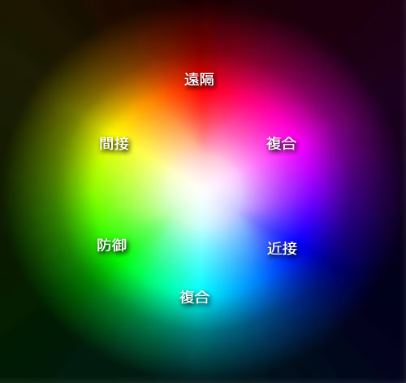

# Brain Burst 2039 Wiki

来源站点：[点击此处](https://w.atwiki.jp/brainburst/)

以下内容为该Wiki站点内容的翻译。

## 站点介绍

本站为神经连接装置（Neurolinker）专用在线对战格斗游戏**BrainBurst2039**（又称Brain Burst或BB）的攻略情报Wiki站。

Brain Burst的玩家通称为《Burst Linker（超频连线者）》。

2039年4月，当时的100名小学一年级学生得到了以在线形式分发的Brain Burst。

目前尚不清楚分发Brain Burst的企业或个人信息。

根据推测，Burst Linker目前约有1000人，分布在以东京23区为中心的地带。

Brain Burst生成的各种VR区域，以及现实/虚拟两侧的Burst Linker社区总称为《加速世界》。

## 导入

### 安装（Install）

- 在Neurolinker中安装《BB2039》，即成为Burst Linker，需要满足下述两个条件：

  - 出生后（最晚一个月内）开始日常佩戴Neurolinker。

    > 由于第一代民用Neurolinker的上市时间为2031年4月，因此截止至2047年6月，只有16岁以下的人才能成为Burst Linker。

  - 与Neurolinker具备超出一定等级的亲和性。

    > 虽然这一条件无法量化，但可通过几个简单游戏的反应速度进行推测。除了先天资质外，幼儿期开始长时间完全潜行（Full-Dive）的经验会使反应速度产生上升的倾向。

- 目前只能通过《**已经安装了BB程序的Burst Linker通过Neurolinker直连的方式进行复制安装**》的方式安装。

- 无法在安装之前判定被安装者是否满足上述的两个条件。当适应性不足时，会显示相关信息并切断传输。

- 一个Burst Linker只能尝试**一次**将BB程序对他人复制安装的行为（包含安装失败的情况）。

  > 加速世界中，一般将身为复制者的Burst Linker称为《亲》，而身为被复制者的Burst Linker则称为《子》。与后续叙述的《军团》不同，《亲子》并不存在系统意义上的特殊关系，但由于二人必然会互相暴露现实身份，因此很难彼此敌对。

  > 游戏开始运行后的大约两年内，复制的次数不受限制，并搭载了在安装前检查被复制者适应性的工具。有人推测，目前复制次数被限定为一次并删除了适应性检查工具的状况，是开发者有意将Burst Linker的总数控制在约一千人的规模导致的。

### 对战虚拟体（Duel Avatar）

- 玩家在Brain Burst中对战时使用的虚拟形象称为《**对战虚拟体（Duel Avatar）**》。

- 安装BB程序后，需要在佩戴Neurolinker的情况下至少六小时的睡眠。在此期间，程序会检查记忆，根据安装者深层心理中对欲望或缺陷的想象（Image）创造对战虚拟体。对战虚拟体的名称和外观为系统自动决定，无法进行任何变更。

  > 这一《安装后最初的睡眠过程》也被称为《滑行睡眠（Runway Sleep）》，意味着加速前的助跑。据称，安装者在滑行睡眠的过程中几乎都会做噩梦。滑行睡眠被中断或是睡眠时间不足的情况下生成的对战虚拟体会出现何种情况，目前尚未确认。

- 对战虚拟体的名字无一例外，均为《颜色名·固有名》的构词形式。系统上使用字母表示。

- 颜色名为决定对战虚拟体特征最重要的元素。色相（色味）决定了《远程》《近战》《间接》的属性，而亮度决定了特殊性的强弱。将这一分布平面化的结果称为《颜色环（Color Circle）》。

- 除此之外，还有着具备特殊属性，因而使用金属命名的《金属色》。其平面化的结果称为《金属色表（Metal Color Chart）》。上述两项由于较为复杂，因此在单独的条目中进行说明。

- 多数情况下，固有名体现了对战虚拟体的外观特征，但也存在例外。固有名的分类包括了《生物型》《器具型》《现象型》和《动词型》。

- 以下列出主要的对战虚拟体的数据。等级为2047年6月的状态。

  - Silver Crow
    - Lv5，生物型，Nega Nebulas所属
    - 必杀技
      - Head Butt (Lv1)
    - 能力
      - 飞行
    - 强化外装
      - The Disaster
  - Black Lotus
    - Lv9，生物型，Nega Nebulas军团长
    - 必杀技
      - Death by Piercing (Lv5)
      - Death by Embracing (Lv8)
  - Sky Raker
    - Lv8，动词型，Nega Nebulas副军团长
    - 强化外装
      - Gale Thruster
  - Cyan Pile
    - Lv5，器具型，Nega Nebulas所属
    - 必杀技
      - Splash Stinger (Lv2)
      - Spiral Gravity Driver (Lv3)
      - Lighning Cyan Spike (Lv4)
    - 强化外装
      - Pile Driver
  - Lime Bell
    - Lv4，器具型，Nega Nebulas所属
    - 必杀技
      - Citron Call Mode 1 (Lv1)
      - Citron Call Mode 2 (Lv4)
    - 强化外装
      - Choir Bell
  - Ardor Maiden
    - Lv7，生物型，Nega Nebulas所属
    - 强化外装
      - Flame Caller
  - Aqua Current
    - 详细不明
  - Graphite Edge
    - 详细不明
  - Scarlet Rain
    - Lv9，现象型，Prominence军团长
    - 必杀技
      - Heatblast Saturation (Lv3)
      - Hailstorm Domination (Lv7)
    - 强化外装
      - Peacemaker
      - Missile Pod
      - Quad Vulcan
      - Twin Cannon
  - Blood Leopard
    - Lv6，生物型，Prominence副军团长
    - 能力
      - Mode Change
      - S Gauge Drain

### 颜色环（Color Circle）

- 颜色环即对对战虚拟体的颜色名对应的属性平面化后的图象。

### 加速点（Burst Point）

- 加速点（BP）是Burst Linker战斗的目的，是被量化的生命值，也是加速世界内的货币。

- 所有的Burst Linker在安装后都会获得100点作为初始点数。

- 使用各种加速指令时会消耗BP。

- 对战胜利时会增加点数，失败时则会扣除点数，且点数的流动会因等级差而变化。胜利时获得的点数如下所示。

|自身等级减去对手等级|获得点数|
|:---|---:|
|+8|2|
|+7|3|
|+6|4|
|+5|5|
|+4|6|
|+3|7|
|+2|8|
|+1|9|
|0|10|
|-1|12|
|-2|14|
|-3|16|
|-4|20|
|-5|25|
|-6|30|
|-7|35|
|-8|40|

   > 失败时的点数流动反向计算（译注：如Lv1的玩家A与Lv2的玩家B对战，A胜利时获得12点而B扣除12点，反之B胜利时获得9点而A扣除9点）。正如此表所示，面对等级低于自身的对手，胜利时获得的利益很少，而败北时的亏损则相当大。反过来也可以说，下位者很难战胜上位者。

   > 2047年时，Burst Linker的新陈代谢（增减速度），根据推定每个月大约增长10人。换而言之，新人对加速世界总的点数池每月只能提供约1000点的贡献。与此相对的，根据推测，每人每月在对战和加速上消耗的点数约为1000点，相当于整个加速世界要消耗10万BP。两者之间约9.9万BP的差值，则通过后续叙述的《Enemy狩猎》补足。

- 加速点清零的Burst Linker会被强制卸载Neurolinker中的BB程序，不再是Burst Linker。他们此后也无法再安装BB程序。

### 加速

- 《加速》指的是通过BB程序扩展Neurolinker的量子通信功能实现的**思维加速现象**。

- 加速倍率通常为1000倍。换而言之，现实世界中的1秒相当于加速状态的Burst Linker体感的1000秒。

- 现实世界的时间与加速世界的时间对比表如下所示。

|现实世界|加速世界|
|:---|---:|
|1s|1000s=16min40s|
|1min|1000min=16hr40min|
|1hr|1000h=41d16hr|
|1d|1000d=~2yr9mon|

（最后一行原文为2yr7mon15d，疑似计算有误。此处按1yr=365d，1mon=30d计算）

### BB控制台

 - BB控制台是未处在加速状态时，点击虚拟桌面上的《Brain Burst》图标后启动的Brain Burst简易操控画面。

 - 相比后面叙述的指示界面，只能进行有限的几项操作。所有在BB控制台可以进行的操作均可在指示界面进行。

 - BB控制台可执行的操作包括确认自身对战虚拟体的状态，登录自动观战虚拟体，以及与伙伴组队。

 - 这些操作可在离线状态（断开与广域网的连接）下进行。

## 对战

### 通常对战

### 直连对战

- 直连对战是两名Burst Linker使用XSB线缆将二人的Neurolinker《直连》后，由其中任意一人加速并向对方申请而发动的对战。

- 规则基本与通常对战相同，但也有下述的不同点：

  1. 无法观战。但超过三名Burst Linker使用XSB线对Neurolinker形成串联拓补结构的情况时，除两名对战者之外的其他人可以观战。
  2. 可在离线状态（未连接到广域网或局域网）的情况下对战。
  3. 仅限直连对战时，可在指示界面执行《强化外装无偿转让》的选项。

### 指示界面（Instruction Card）

### 战区（Area）

- 战区是以现实世界的行政区划为基准并进一步细化的，加速世界的各个分区。

- 以东京23区为例，每个行政区大致分为1到3个战区。考虑到Burst Linker的人数和地形影响，在其他地区，单个战区的面积有扩大化的倾向。

  > 纵使如此，在目前几乎所有Burst Linker都集中于东京都中心区域的状况下，在其他一级行政区进行战区划分基本没有意义。作为例外，有情报显示神奈川县横滨市有约数十人组成的Burst Linker社区。

- 每个战区均设有一个对战玩家列表。战区边界在通常对战区域中以不可侵入的屏障形式存在，无法穿过屏障移动到其他战区。

- 乘坐公交车或电车时加速/对战，并在对战时跨过了战区边界的情况下，对战仍会继续进行。

- 只要在战区内连接到广域网，就必然会被列入对战玩家列表。唯一的例外是该战区为某军团领土的情况，此时该军团的成员可在BB控制台进行《拒绝乱入》的设置。

### 对战玩家列表（Matching List）

- 对战玩家列表（Matching List，或称匹配玩家列表）是自身接入广域网时所在的区域内，或是位于连接的局域网内的Burst Linker的一览表。可在初始加速空间或通常对战区域内，通过指示界面浏览。

- 在初始加速空间中，可在列表中选择任意对手，按下Duel按钮=申请对战=《乱入》。

- 在对战玩家列表上，除单人玩家外，也会显示组队的Burst Linker。单人玩家可以挑战组队玩家，反之则不能进行。

### 升级（Level Up）

- 消费对战胜利、狩猎公敌等状况下获得的BP，可用于对战虚拟体的**升级**。

- 升级伴随的收益包括提升体力值/必杀技值、强化基本攻击力/防御力、获得升级奖励等等。

  > 虽说如此，由于这是一款对战格斗游戏，因此并不会像MMORPG一样在体力和参数上存在决定性的差异。如果只有3级左右的等级差，也足以通过运用战术或是利用对战区域的属性，实现逆转取胜的目标。

- 升级所需的BP如下所示：

|等级提升|所需BP|
|:---|---:|
|Lv1→Lv2|300|
|Lv2→Lv3|400|
|Lv3→Lv4|600|
|Lv4→Lv5|900|
|Lv5→Lv6|1500|
|Lv6→Lv7|3000|
|Lv7→Lv8|6000|
|Lv8→Lv9|10000|
|Lv9→Lv10|?|

  > 需要留心的一点是，升级时这些BP会随着消费而直接消失。换而言之，在进行升级操作前，必须保证升级后剩余的点数处于足够安全的范围内。身经百战的Burst Linker中，有为数不少的人会选择放弃升级带来的利益，仅凭自身的经验和战术直觉在低等级的状态下维持生存。

### 技能/能力/道具

- 对战虚拟体除拳击（Punch）或踢击（Kick）等通常技外，还可获得《必杀技》、《能力》和《强化外装》中的一个或多个。

- 这些技能/外装可能为初始持有，或在升级时作为奖励选择获得。但初始装备和奖励选项因不同的对战虚拟体而会在倾向上产生差异。

- 必杀技会消耗一定量的必杀技值（S Gauge），进行强力的攻击、强化或是妨碍动作。原则上在发动必杀技时会产生强烈的光效。使用必杀技时，需要在做出规定动作的同时准确喊出技能的名字。所有的必杀技都属于主动技能（Active Skill）。

- 能力（Ability）可以使对战虚拟体做出未持有该能力时不可能做到的特殊动作。不同的能力在发动时，有些会消耗必杀技值，有些则不会发动。几乎所有的能力即使发动也不会产生光效。所有的能力都属于随时发动的被动技能（Passive Skill）。

- 强化外装是对战虚拟体装备的，用于提升攻击或防御力的道具。可通过声音指令在持有状态和装备状态之间互相切换。对于强化外装而言，除了《初始装备》和《升级奖励》之外，还有《他人转让或强制夺取》《商店购买》《Enemy掉落》《迷宫内获得》等多个获取手段。强化外装拥有单独的耐久值，虽然也有在对战中被破坏的情况，但和对战虚拟体的身体部件一样会在下一次对战时完全恢复。

  > 目前已确认有被称为《七神器（Seven Arcs）》的特殊强化外装存在。这些外装的名字均以加定冠词The的形式方便识别。已知的《七神器》包括蓝之王Blue Knight持有的《The Impulse》、绿之王Green Grandee持有的《The Strife》、紫之王Purple Thorn持有的《The Tempest》和另一个。

### 军团（Legion）

- 《**军团**（Legion）》是系统规定的Burst Linker集团，相当于其他在线游戏中的《公会（Guild）》或《队伍（Team）》。

- 组建军团——即成为**军团长**（Legion Master）需要升级到Lv4后，在无限制中立区域中完成《军团长任务（Master Quest）》。

- 获得军团长资格并组建军团的Burst Linker，其指示界面上会出现《军团》标签，可在其中执行招募成员、任命职位、领土宣称或对成员执行《断罪一击》。

- 军团长或副军团长在初始加速空间、通常对战区域或无限制中立区域招募的Burst Linker，可加入该军团。加入军团的成员可在指示界面上看到《军团》标签，但只能查阅军团成员或领土状态。

- 军团长可对军团成员实行《**断罪一击**（Judgement Blow）》使其强制点数清零。即使军团成员离开了军团，在离开后（现实世界的）30天内仍会成为被《断罪》的目标。

- 军团成员在该军团领土覆盖的区域内，即使连接到广域网，仍然可以拒绝被系统列入对战玩家列表。

### 领土战

- 《**领土**》指的是军团执行领土宣言的战区。

- 在领土内，该军团的成员可获得在连接到局域网时仍可拒绝被乱入的巨大特权。但军团为了维持领土，必须在每周六下午的**领土战**中获得超过50%的胜率。

- 领土战争于每周六的16-17时进行。

- 防守一方于领土战开始前，需在指示菜单的军团选项卡中指定防守每一部分领土的成员，并令他们在领土内准备。这些成员在领土战期间会被自动从对战玩家列表中屏蔽出去。防守方的成员人数可自由决定，不设上限。此外，防守方的成员也不限制出击次数。

- 攻击一方于领土战开始前，需在指示菜单的军团选项卡中指定攻击每一部分领土的成员，并令他们在领土内准备。与防守方不同，他们不会被从对战玩家列表中评比出去，因此一般会在攻击开始前才连接到广域网。攻击方在领土战中查看对战列表时，会出现防御方军团的名字，点击军团名后按下DUEL按钮开始领土战。但是，攻击方的人数不得超过防守方的人数，超过时按照等级从高到低的顺序自动选择（等级相等时随机选择）。对同一区域的领土战，攻击方每人只能出击一次。

- 作为例外，防御方的队伍只有1到2人的情况时，攻击方可以设定3人发动攻击。由于这一机制的存在，军团的成员需要至少三人。

- 领土战的区域中包含了数个通常对战区域中没有的《**据点**（Foot Hold）》。在据点内，对战虚拟体的必杀技值会自动恢复。

- 领土战的胜者，为全灭敌方队伍的一方、或30分钟后存活人数更多的一方、或存活人数相同时HP值总量更多的一方。战斗结束后，系统会自动评判双方的战斗表现，并以《评价点》的形式显示。

- 在一小时的领土战期间，防守方在团队战的总次数中获得50%以上的胜率即可维持对这一领土的支配权。如进行3次团队战（领土攻击）时需胜利2次，2次团队战时胜利1次，仅发生1次团队战时则需在该次团队战中获得胜利。

- 攻击方获得50%以上胜率的情况下，该领土的支配权会消失。如果只有一个军团发动攻击，则支配权归属该军团。多个军团发动领土攻击的情况下，获得更多胜利次数，或是在胜利次数相同情况下获得更高的评价点的军团会获得这一领土的支配权。

- 领土战不论胜败，均不会发生个人BP的流动。

### 心意系统

- 详细不明。

## 世界

### 初始加速空间

- 《**初始加速空间**（Blue World）》是使用《Burst Link》指令后，伴随思考加速而完全潜入（Full Dive）的虚拟世界。

- 通过读取严密铺设的《社会安全监控摄像头（Social Security Surveillance Camera，以下称监控摄像头）》网络画面，重新构筑蓝色透明的立体空间。摄像头监控范围之外的部分通过预测算法进行补足。

- 在这一世界中，Burst Linker的形态为事先在BB控制台中设定的任意虚拟形态（并非对战虚拟体）。

- 在这一世界中，Neurolinker的虚拟桌面仍会维持原有的状态，可以启动绝大多数的外部程序。

  > 即使如此，因为思维被加速到了1000倍，程序无法如常运作的情况仍然大量存在。由于编辑器等程序可以正常运转，对于在短时间内完成学校作业或测验的情况非常有效。除此之外，还有近乎无穷多种处于灰色区域的利用方法，但各个军团对这一行为进行限制的情况较多。

- 在初始加速空间中按下BB图标，启动《指示界面》，翻阅《对战列表》，对想要对战的玩家进行《乱入》是Brain Burst中最为传统的对战开始方法。

- 在直连状态下，双方（或三人以上）使用《Burst Link》指令，可进入同一加速空间。

- 在初始加速空间中的停留时限为内部时间的30分（现实时间的1.8秒）。超时后自动停止加速并回归现实世界。仍处于启动状态下的Neurolinker用程序不会退出。除此之外，也可以通过《Burst Out》指令停止加速。

### 通常对战区域

- 通常对战区域是Burst Linker使用对战虚拟体，进行一对一或二对二的《对战》所在的虚拟空间。

- 和初始加速空间一样，使用监控摄像头的画面重构现实中的地形，但因为各种《属性》的影响，外观会发生大幅变化。不过，建筑物和道路等基本构造仍然和现实一致。

- 通常对战区域的面积等同于对战所在的战区面积。战区边界在对战区域中以不可侵入的屏障形式存在，无法跨过边界进行移动。

- 通常对战区域随对战的启动而生成，随对战的结束而消失。换而言之就是《临时地图（Instance）》。

- 以下列举主要的区域属性。属性名并非系统上规定的名称，而是Burst Linker们使用的通称。

|Stage List|||
|:---:|:---:|:---:|
|世纪末Stage|炼狱Stage|黄昏Stage|
|冰雪Stage|草原Stage|工厂Stage|
|原始林Stage|腐蚀林Stage|荒野Stage|
|沙漠Stage|月光Stage|焦土Stage|
|魔都Stage|风化Stage||

### 无限制中立区域

- 《无限制中立区域》是升级到Lv4的Burst Linker，通过《Unlimited Burst》指令潜行进入的虚拟世界。

- 与进行通常对战时，临时生成和消灭的《通常对战区域》不同，无限制中立区域是不会消失的《永久地图（Permanence）》。

- 地图内没有各区域间的边界，也没有不可侵入的屏障。规模相当于现实世界中监视摄像头覆盖的范围，也就是日本全境。

- 地图内有无数被称为《Enemy》的AI怪物栖息。打倒Enemy时会获得BP，极少的情况下还会获得强化外装等道具。Enemy分为《通常级（Normal）》、《巨兽级（Beast）》、《神兽级（Legend）》和《超级》四个类别。

- 地图内的各处设有名为《商店》的设施。商店内可交易强化外装、卡片道具或玩家小屋，并可承接任务。也可以在商店中卖出作为初始装备的强化外装并转换为BP。这一状况下，售出的强化外装可被所有人购买。

- 地图内的各处有着名为《Dungeon》的地下或地上迷宫，内部生活着相当强大的Enemy，但获得道具的概率相较之下也会上升。如果能够到达迷宫的最深处，也会有相当低的概率获得强化外装。

- 在无限制中立区域获得的道具初始状态下为卡片形式。这些道具可在实体化后使用，或在保持为卡片的形态下使用。

- 若需在无限制中立区域自行注销，必须穿过设置在各处地标的《脱离点》内的《传送门（Portal）》。玩家无法使用指令注销。

- 若在无限制中立区域内HP归零（即死亡），会变为《幽灵状态》，在60分钟的内部时间之后自动复活。幽灵状态下的移动区域限制在死亡位置为中心，半径10米的范围内。

- 无限制中立区域的属性通称为《混沌》——这一通称来自于因名为《变迁》的系统而造成的，内部时间的一天到一周内进行的属性变换。每逢变迁，被破坏的地形和物品会被修复，Enemy也会被重新配置。无限制中立区域的属性基本上比照通常对战区域的属性，但也有仅限无限制区域才会出现的稀有属性。

### 帝城

## 其他

### 指令（Command）

以下列出Burst Linker可使用的指令。

- Burst Link （Lv1可用，消耗1BP）

  - 最基本的加速指令。使用后思维加速到现实世界的1000倍，并进入初始加速空间。可于在线和离线状态下使用。
  
    > 即使Neurolinker处于离线状态，也会自动连接并侵入监控摄像头网络。周围未布置监视摄像头或Neurolinker的网络连接功能物理停机的状况下，会使用Neurolinker自带的摄像头构筑周围区域。Neurolinker自带摄像头不可用的情况下，不会重现周围的景象。

- Burst Out （Lv1可用，消耗0BP）  

  - 停止加速的指令。仅可在初始加速空间内使用。

- Physical Burst（Lv1可用，消耗5BP）

  - 将意识保留在现实身体的情况下加速的指令。思维的加速倍率相当于现实的10倍。持续时间为3秒（体感时间30秒）。加速时可以驱动现实中的身体，但身体的动作不会被加速。

- Unlimited Burst（Lv4可用，消耗10BP）

  - 潜行（Dive）进入无限制中立区域的指令。必须在接入广域网的状态下使用。与初期加速指令不同，没有与之对应的脱离区域（加速停止）指令。

- Physical Full Burst（Lv9可用，消耗当前持有BP的99%）

  - 将意识保留在现实身体的情况下加速的指令。加速倍率相当于现实的100倍。持续时间为3秒（体感时间300秒）。加速时可以驱动现实中的身体，且身体的动作也会被加速到接近通常情况下100倍的状态。必须在BP超过100点的情况下才能执行这一指令。
  
    > 原理和存在目的均谜团重重的指令，目前尚不清楚是否有人使用过。根据推测，这一指令会驱动包括大脑在内全身细胞骨架（微管）中的光量子网络。

### 点数清零

- BP被扣到0的Burst Linker会被强制卸载Neurolinker中的BB程序。

- 卸载后，无法从之前的《亲》或是其他Burst Linker那里再次复制安装。即使更换了Neurolinker机型，由于大脑内的光量子模式（Pattern）存在个人特征，因此仍然无法安装。

  > 根据尚未确认的传言，BP清零者不仅失去了BB程序，也会失去和BB相关的一切记忆，连同对加速世界的兴趣和执念也被限制。详细的原理仍然不明。

- 在仍保有BP时发生Neurolinker硬件损坏而无法使用的场合，如果将上一台Neurolinker的《核心芯片（Core Chip）》移植到新的Neurolinker，则核心芯片内的Key程序会自动从BB服务器下载BB程序并恢复到先前的状态。若核心芯片发生损坏，可以通过和《亲》或其他Burst Linker直连的方式获取新的Key程序并进行恢复。若这两点均无法满足，目前尚不清楚BB是否准备了更进一步的救济手段。

### 游戏通关（Game Clear）

 - 名为Brain Burst的游戏是否存在《通关》——即游戏的《结局》，目前在Burst Linker之间并没有统一的意见。

 - 等级升到Lv9的玩家会收到系统的一份信息，内容如下：

   - 升级到Lv10需要在通常对战、直连对战或无限制中立区域的战斗中击败5位同为Lv9的玩家。

   - 被击败的玩家会瞬间失去所有BP。

   - 升级到Lv10的玩家会获得接触《Controller》的机会。

 - 当有人达到Lv10的瞬间游戏通关，加速世界灰飞烟灭——这一点是否会发生，目前扔不确定。

 - 除此之外，还有传言称到达无限制中立区域中央的《帝城》中心也可以通关游戏。

 - 在Brain Burst开服后七年，目前仍无人达成这两个条件中的任意一个。
