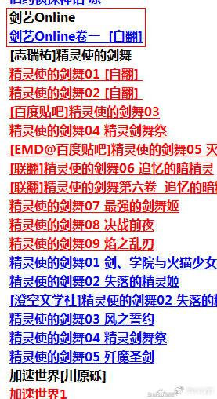
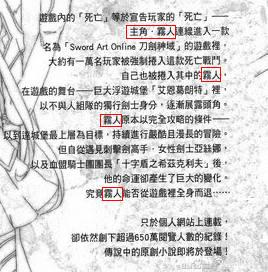
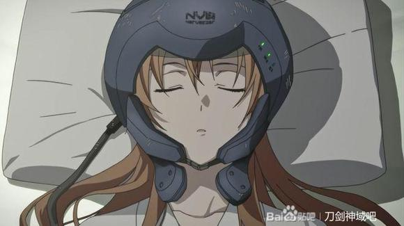

# 「刀剑神域」为何译作『刀剑神域』

作者：SAWAHIRO

贴吧冲浪看到了这个问题，想起来在2013年左右曾有贴吧用户考据过这个问题，但由于历史原因，原贴内容全部消失了，于是在考古一番后，决定重新整理这些考古历史，再次补档这些过往的故事。

感谢当年的原作者@看客之一 和@sinicy20 协助提供的历史资料。

***

《刀剑神域》日文名《ソードアート・オンライン》，字面直译为《Sword Art Online》，就是三个英文词。最早的中文翻译版本来自于知名轻小说翻译论坛——轻之国度论坛的某位翻译大佬（信息已不可考）首次尝试翻译该轻小说作品，当时译者给出的中文译名为《剑艺Online》，但是由于某些原因，被台版追上进度，于是弃坑了。目前能看到的历史遗迹仅有下图，真想瞻仰一下初版的中文译文啊……

***

在百度百科可以随意编写的年代，还有着剑艺Online的百科词条，当时的百科介绍如下：

“破关前登出不可能，Game Over则意味着真正的死亡——。满是谜团的次时代MMO“Sword Art Online（简SAO）”，登陆其中却不知真相的玩家约10000名，至此，残酷的Death Game拉开了序幕。SAO参加者之一的主人公—雾人，在最早的时刻发现并接受了这一“真实”。之后，他活跃于游戏的舞台——巨大的浮游城“艾因古拉德”，作为不参加组队的单练玩家崭露头角。目标突破100层的破关条件，雾人独自继续着冒险，但在他的面前突然出现了使西洋细剑的名手—女流剑士阿斯娜，还被强地拉入组队。这一场相遇，正是雾人的命运齿轮转动的契机——！”

但时至今日，你在搜索引擎搜“剑艺Online”，依然能找到一些零星的历史遗迹碎片就是了。

***

然后就是《刀剑神域》如今的译名了。

这一译名来源于轻之国度的翻译——3000TK大神（ID:jysb01），俗称TK姐。

虎扑论坛动漫区的某个帖子提供了很多参考资料：

“记得刀剑神域这个名字还是轻国的TK姐（ID：3000TK）最早提出的，最后成了官方认可的译名，最早有人自翻的时候据心疼姐回忆用的是一个叫《剑艺online》的名字，也就是直译，可以说TK姐真是文才十足，想出如此帅气的名字。刀剑神域自从TK姐和心疼姐接手后两人一直以J.C.T.G的名义自行翻译，后来TK姐受不了无脑催稿的丧心病狂的读者每天一封站内信的骚扰索性退出的轻国，后来便由心疼姐翻译了。第十卷由于心疼姐对于催稿感到反感索性把帖子关了，现在完稿的版本为贴吧自翻。”——虎扑论坛动漫区 @紅葉知弦

***

最后放一些历史遗存，可见当年主角名的中文翻译也是历经波折，最后才得以确定下来的。

> Naztar: 應該是因為加速1出台版的當時，刀劍1卷的翻譯還沒開始（或者說，還沒翻到後面桐亞互表身分那段），只看簡介自然不知道キリト這個名字是怎麼來的，漢字的選用就會出現分歧

***

最后补充一点其他翻译故事。

1.众所周知，桐人的剑技Starburst Stream，中文名译作星爆气流斩。这一翻译来自于台版译者周庭旭（人称星爆气流斩之父，他负责了台版刀剑IP相关的大部分作品翻译，包含本传、进击篇及外传小说，甚至川原最新作《恶魔纹章》的翻译依旧由他负责）。但是由于川原砾本人在《加速世界》一书中给出了Starburst Stream该技能的汉字写法，于是要求中文翻译将这一写法同步进《刀剑神域》内，所以如今该技能的正确官方称呼为星光连流击（日语汉字：星光連流撃）。这也算实侧面对这两部作品并轨的暗示之一了。

2.刀剑神域作品中的主要头盔产品NERvGear（日文：ナーヴギア）这个名字，多年以来无论是两岸的官方翻译还是民间翻译，都没有发现这是一个错误拼写，其正确拼写应为Nerve Gear。（下图放大可以注意到）

3.《刀剑神域》小说的民间翻译历史久远且从未断代。从最早的J.C.T.G，然后到SD_nagi（心疼姐）接手做了大部分中盘的翻译，然后再往后是reekilynn（rkl）接手，组团做完了整个UW篇的WEB版，往后的SAOP和UW的文库版基本都是蜂鸣器（鸣泣）接手，然后也坑了，后来ALO昙花一现接了部分SAOP，到如今主要是拉斯接坑后续翻译。翻译的完整不断代，在轻小说翻译圈也属于是难得一见的。

***

参考文献：

<https://tieba.baidu.com/p/2164300547>

<https://bbs.saraba1st.com/2b/thread-1630706-1-1.html>

<https://weibo.com/1763225332/5067026765186293>
